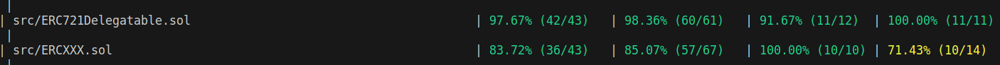

# DELEGATION OF ASSETS SOLUTION ⚙️
##### OpenFort Challenge 💥

---

## Index 📚
- [DELEGATION OF ASSETS SOLUTION ⚙️](#delegation-of-assets-solution-️)
        - [OpenFort Challenge 💥](#openfort-challenge-)
  - [Index 📚](#index-)
  - [Introduction 📝](#introduction-)
    - [Initial Observations About Usecases 👀](#initial-observations-about-usecases-)
  - [1️⃣ ERC-XXX](#1️⃣-erc-xxx)
  - [2️⃣ delWrap (delegation wrapper)](#2️⃣-delwrap-delegation-wrapper)
  - [Run locally && testnet 🏡](#run-locally-&&-testnet-)
      - [Anvil - Localhost 🏠](#anvil---localhost-)
      - [Sepolia - Testnet 🏠](#sepolia---testnet-)
    - [Run Tests 🤖](#run-tests-)

---

## Introduction 📝
---

This repo aims to implement an efficient, sacalable and secure solution for delegating ERC721 assets on-chain without transferring ownership and allowing the delegatee to benefit from its use. It also considers and exemplifies how this delegation functionality could be extended to other types of tokens or assets.

---

When building something you should first know: what are you building that for? Thus here I add this section:

<details> <summary> Initial Observations About Usecases 👀 </summary>

### Initial Observations About Usecases 👀

Notice that, because of the ownership constrain, any action the delegatee would like to carry out with the deleagated asset that involves some call to `transfer()` or `transferFrom()` functions will be rejected.

Thus the only compatible 3rd party contracts which implement services to the owners or "valid operators" of assets will be the ones who only do so without using the above mentioned functions. Thus, for example, investment platforms that require deposits in vaults aren't compatible with a delegation mechanism that doesn't change ownership.

So far the only kind of applications or functionalities that would benefit from delegation are:

- Lending or renting of NFTs, semi-fungible or fungible assets.
- Voting features where the votes are represented by ERC20, ERC721 or ERC1155 assets.
- Apps with special access to features if you are able to use (even if not owning) a specific asset.

<details> <summary> See specific examples 👁️  </summary> 

1️⃣ Lending or renting unique characters in a game.

2️⃣ Lending or renting different items in that game.

3️⃣ Delegating vote in some DAOs (or inside a game in some internal democracy)

4️⃣ Lending or renting a club membership NFT so you can use their features only available for club members. 

</details>
</details>

<br/>

On top of all these I thought of making the solution as backwards-compatible as posible with all current token/assets standards. This is why I came up with 2 solutions that implement the delegation functionality:

1. I've defined a new ERC to implement the delegation, the ERC is thought so as to extend any of the current assets ERCs or future ones.

2. A wrapper that could wrap already deployed asset contracts so they can use the delegation functionality.

Due to time limitations, I've only delevoped properly solution 1️⃣, but you can check some overall definitions and design on how solution 2️⃣ would work.

---

## 1️⃣ ERC-XXX

<details> <summary> ERC-XXX details 📜 </summary>

A new ERC that defines a standard on how assets that whish to have this delegate functionality should be implemented and behave.

This is incompatible with everything non-upgradeable already deployed as it's an extension for current and future standards. Only asset contracts behind an upgradeable pattern could be compatible.

See the **ERC-XXX** specification and docs [here](./documentation/ercXXX.md).

 </details>

## 2️⃣ delWrap (delegation wrapper)

<details> <summary> delWrap details 📜 </summary>

A contract that can be placed on top of (wrapped around) any of the base existing asset standards, whether ERC20,721,1155 (also around new standards in the future). 

Even though it is compatible with the assets' contracts, it can be incompatible with some 3rd party services that use those contracts. See which kind of 3rd party services are incomaptible and more design choices in [delWrap.md](./documentation/delWrap.md).

This is because the wrapper contract is essentially a kind of PROXY and Adapter in between 3rd party services and the already deployed asset contracts. Tries to implement new logic without having to change any of the interfaces. The full compatibility for all 3rd party services (at least with ERC721) is impossible as explaned in the [delWrap.md](./documentation/delWrap.md) but it has been tried to be as compatible as posible.

More detials on the **delNft** docs [delWrap.md](./documentation/delWrap.md).

</details>

---

## Run locally && testnet 🏡🌐

<details> <summary> Run locally 🏡🌐 </summary>

Clone the repo and build the contracts:

```bash
git clone https://github.com/CarlosAlegreUr/OpenFortChallenge.git
foundryup
forge install
forge install OpenZeppelin/openzeppelin-contracts
forge build
# This will load some public foundry values to an .env file
cp .env.example .env
source .env
```

Now to see all commands available run:
    
```bash 
make
``` 

### Actions Guide 📜
<details><summary> Actions Guide 📜 </summary>  

```bash
# Deploys the contract
make deploy

# Mints 1 nft with the defualt 0 account of Anvil
make mint

# Burns nftId
make burn nftId=a_NUMBER

# Delegates nftId to the address
make delegateTo to=an_address nftId=a_NUMBER

# Undelegates nftId to the address
make undelegateTo to=an_address nftId=a_NUMBER

# Undelegates all nfts delegated
make undelegateFromAll

# Transfers nftId to the address
make transfer to=an_address nftId=a_NUMBER

# Checks if to has been delegated by delegator the nftId 
make isDelegatee delegator=an_address to=an_address nftId=a_NUMBER
```
</details>

---

### Anvil - Localhost 🏠

To run in local `Anvil` chain you don't need to configure anything, just spin up the anvil chain in another terminal from within the project:

```bash
# To spin up the anvil chain
anvil
```

Then just play around with the options displayed in `make`. The default account used will be the 0 account of `Anvil`:

---

### Sepolia - Testnet 🌐

I've already deployed a collection here: [See in Etherscan](https://sepolia.etherscan.io/address/0x92375AaaaE9AF691c88d58B9470c3a5C9fca523c)

You can deploy more if you want, to run the commands in sepolia you need to configure some stuff and add to the make instructions `CHAIN=sepolia`.

<details> <summary> Configuration & Run ⚙️ </summary>


#### Things to conigure before running ⚙️

1️⃣ Fill the `.env` file with your data. (_the etherscan api key is optional_)

2️⃣ Now you need to safely add your private key to the project:
```bash
# Follow the isntructions and remember your password
cast wallet import yourKey --interactive
```

3️⃣ Now you should be able to run all the anvil commands in sepolia like:

```bash
# Note that for every command you will have to provide the password you used to import your private key 
make deploy CHAIN=sepolia
```

</details>

</details>

---

## Run Tests 🤖

Only comprehensive testing for `ERCXXX` extending `ERC721` tokens has been implemented due to the time limits and main focus on them for the assignment.

### Coverage 📈



> 📘 **Note** ℹ️: **ERCXXX** coverage is not as good as **ERC721Delegatable** because tests are only written for the latter one which doesn't require some extra cases of the first one. This is because NFTs are unique and scenarios where multiple amounts of the same token can be transfered through **ERCXXX** are not tested.

Compute coverage with:

```bash
forge coverage
```

### Run tests 🏃 (unit, fuzz, invariant) with:

```bash
# Runs all tests
forge test

# Runs only unit tests
forge test --match-test test_

# Runs only fuzz tests
forge test --match-test testFuzz_

# Runs only invariant tests
forge test --match-test invariant_
```


