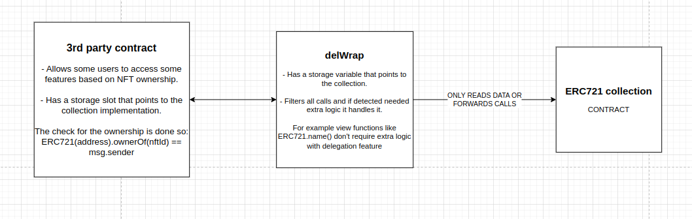

# delWrap 📜

A contract that can be placed to wrap around any of the base existing asset standards, whether ERC20,721,1155 (also around new standards in the future).

To do so just set the `wrappedContract` address to the address of the asset contract you want to wrap around.

The `delWrap` contract will serve as a sort of PROXY with a filter, passing calls whenever is needed or filtering them and adding the delegation functionality feature to the functions that require them.

Here is a diagram explaining how it would work with ERC721:



Notice that for a 3rd to be compatible with the `delWrap` contract it should be able to change the assest contract address it calls to now call `delWap` instead of the collection directly.


# delWrap with other assets 🌐

## ERC20

In ERC20 the derived contract will not have an NFT indicating delegation ownership but a mapping to delegated balances. And when reading the balance of a user the `balanceOf()` function will be wrapped around to return the delegated balance + the actual balance of the user just in case the user also happens to own some tokens.

```solidity 
    mapping(address => uint256) public delegatedBalances;

    function _delBalanceOf(address account) public onlyInternalCall returns (uint256) {
        return delegatedBalances[account] + wrappedContract.balanceOf(account);
    }:
```

# No more scenarios have been explored due to lack of time and due to deciding to better focus on properly implement ERCXXX

---